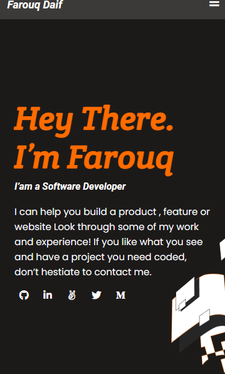

##My Portfolio

> n this project, I will set up the first milestone in the process of creating My website. My goal here is to master n order to lay out the elements on the page you should use Flexbox in all 2 sections.
You don't need to implement any functionality that requires JavaScript, like opening the menu or creating dropdowns.

Additional description about the project and its features.

## Built With

- Major languages:Html and CSS
- Technologies used :GIT and GitHup 

## Authors

👤 **Author1**

- GitHub: [@farouqdaif1](https://github.com/farouqdaif1)
- Twitter: [@farouqdaif](https://twitter.com/farouqdaif)
- LinkedIn: [LinkedIn](https://www.linkedin.com/in/farouqdaif/https://www.linkedin.com/in/farouqdaif/)

## 🤝 Contributing

Contributions, issues, and feature requests are welcome!

Feel free to check the [issues page](../../issues/).

## Show your support

Give a ⭐️ if you like this project!

